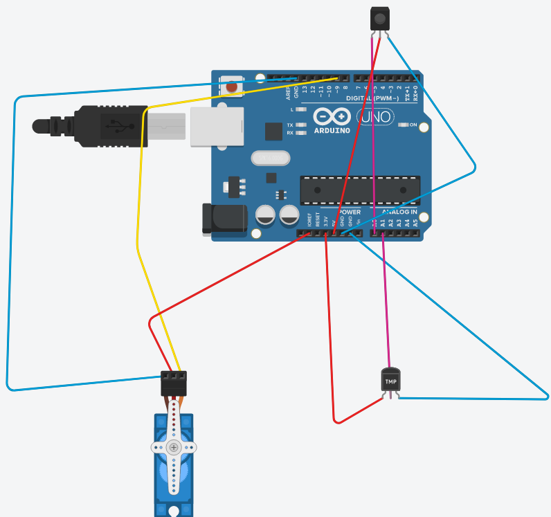
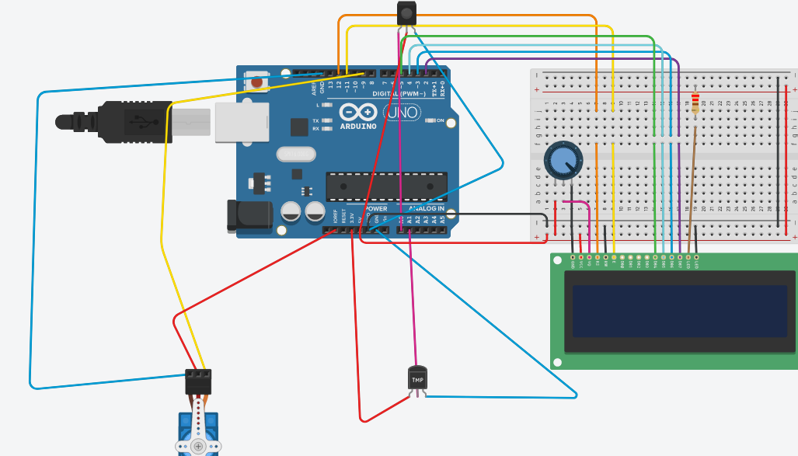

# Arduino-Automotive-Plant-Watering
Using a  Soil Moisture Sensor and a FS90 servo. I've made a Automotive Plant Watering system.

## Necessary schema 
_If you use just serial monitor:_

_And with LCD:_


_I didn't found the soil moisture sensor but i've found a placeholder_
## Requirements
  Hardware:
  * An Arduino Uno Booard
  * A breadboard
  * A data cable
  * Soil Moisture sensor
  * Temperature sensor
  * servo motor FS90
  * 9 Father-Father wires (without the LCD ones)
  * LCD shield if using `LCD.ino`
  
  Software:
  * Arduino IDE
  * LCD library
  * Servo library
## User Manual
* You need to download the desired project from Github
* Open it in a Arduino IDE
* Verify and Upload on a compatible board
* Put the moisture sensor in a pot of a plant
* And glue a plastic glass of water on the servo
* Once it starts be shoocked by the amount of water your plant needs
* And also you can see the temperature in the room
  *```if ( sensorValue > 850.0)``` the number 850.0 may be changed with something more suitable for your plant, I've worked with nothing but plain soil (it dries faster)
## Explanations
  * For this project to work properly you need to put the moisture sensor all the way down or it won't measure perfectly.
  * Usually the temperature sensors need adjusments, mine for some reason show the good temperature without changing the value of the sensor readings
  * I've done an avarage of the values I got from the Soil moisture and temperature sensor for a better accuracy
  ### Bibliografy
* [Soil Moisture Sensor](https://create.arduino.cc/projecthub/electropeak/complete-guide-to-use-soil-moisture-sensor-w-examples-756b1f)
* [Temperature Sensor](https://learn.adafruit.com/tmp36-temperature-sensor/using-a-temp-sensor)
* [LCD](https://www.robofun.ro/shield-lcd-16x2)
* [Servo](https://www.instructables.com/id/Arduino-Servo-Motors/)
